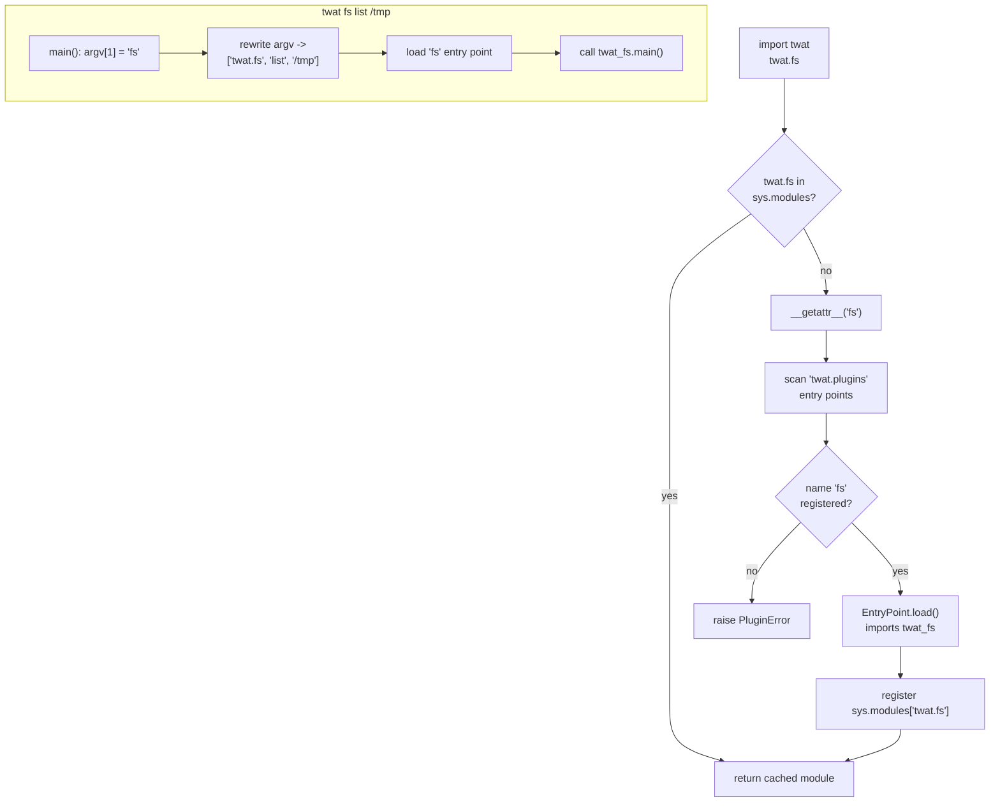

<!-- this_file: src_docs/md/01-architecture.md -->
# Architecture

`twat` is built on one standard Python feature: **entry points**. A package can
advertise itself under a named group at install time, and any other package can
enumerate that group later — without importing anything. `twat` reads the
`twat.plugins` group to build a namespace on demand.

## The entry-points mechanism

When you `pip install twat-fs`, its `pyproject.toml` contributes one line of
metadata to your environment:

```toml
[project.entry-points."twat.plugins"]
fs = "twat_fs"
```

Nothing runs. The mapping `fs → twat_fs` just sits in installed metadata until
the host looks it up.

## How `twat.fs` becomes a module

`twat.__getattr__` fires on any attribute the host module does not already have.
It resolves the name through the `twat.plugins` group, imports the target,
caches it in `sys.modules` as `twat.<name>`, and hands it back. The CLI takes
the same path, then calls the plugin's `main()`.



## Discovery without import

Two read-only views never import a plugin — they read metadata only, so they
stay instant even with a hundred plugins installed:

| Function | CLI | What it reads |
|---|---|---|
| `iter_plugins()` | `twat --list` | names in the `twat.plugins` group |
| `iter_available_plugins()` | `twat --available` | every installed `twat` / `twat-*` distribution + the plugin it registers |

`doctor()` (`twat --doctor`) is the deliberate exception: it *does* import every
plugin, because catching a broken import is the whole point.

## Module map

```text
src/twat/
├── __init__.py        # host engine: discovery, loader, namespace proxy, dispatcher
├── __main__.py        # `python -m twat`
└── common/
    ├── cli.py         # shared CLI helpers + shell-completion generator
    ├── exceptions.py  # PluginError (raised with plugin context)
    └── logging.py     # plugin-aware loguru setup with a no-op fallback
```

## Design choices

- **Lazy everything.** Listing never imports plugins; the host imports a plugin
  only on first attribute access or dispatch. This keeps `twat --help` and
  `twat --list` instant regardless of how heavy the installed plugins are.
- **Errors carry context.** A failed load raises `PluginError` with the plugin
  name attached, instead of leaking a bare `ImportError`.
- **The plugin never knows.** On dispatch the host rewrites `sys.argv[0]` to
  `twat.<plugin>`, so a plugin behaves identically whether invoked as
  `twat fs …` or as its own `twat-fs` script.
