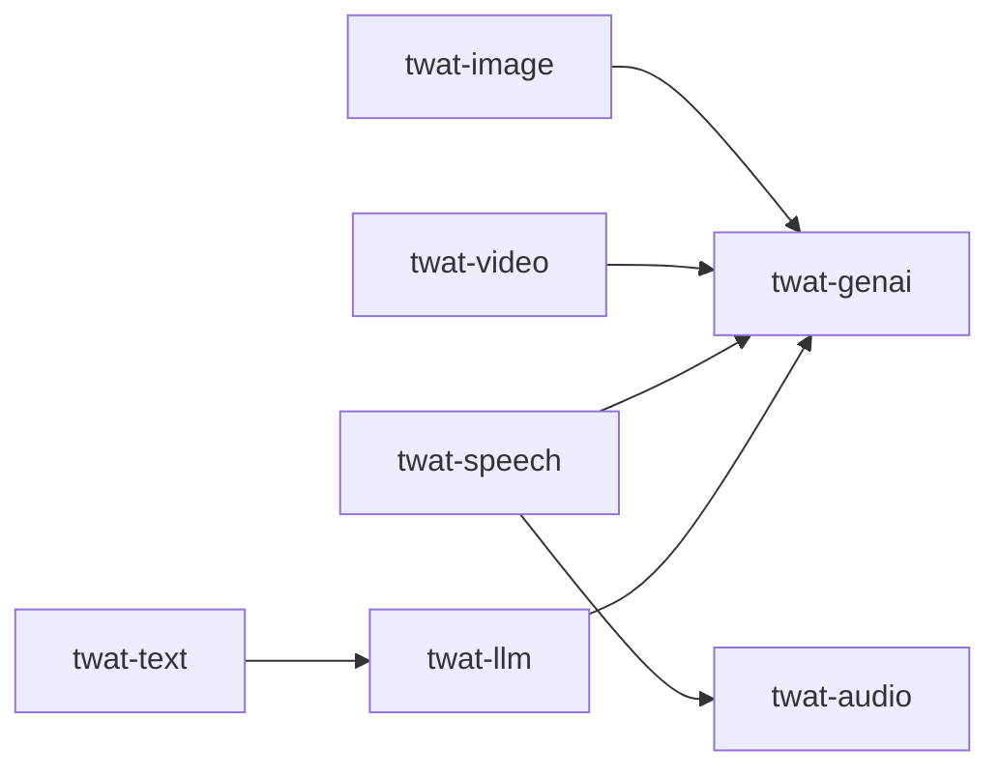

<!-- this_file: src_docs/md/04-plugins.md -->
# The plugins

The `twat` ecosystem is 17 independently published plugins. Install only what
you need, or grab everything with `pip install twat[all]`.

```bash
pip install twat-fs          # one plugin
pip install twat[all]        # the whole ecosystem
twat --available             # see what is installed and which plugin it registers
```

## All plugins

Each row is a separate PyPI package. The **plugin** column is the name you use
as `twat.<plugin>` and `twat <plugin> …`; the **package** column is what you
`pip install`.

| Plugin | Package | What it does |
|---|---|---|
| `audio` | `twat-audio` | Audio resampling (Pedalboard) plus ffmpeg-backed normalize/trim/extract/replace helpers. |
| `cache` | `twat-cache` | Flexible caching decorators — LRU, disk, and file backends via cachebox/cachetools. |
| `coding` | `twat-coding` | Python project scaffolding and stub generation (AST + MyPy backends). |
| `ez` | `twat-ez` | Convenience utilities for strings, paths, and environment access. |
| `font` | `twat-font` | Font file organizer and manager (`FontInfo` / `FontManager`). |
| `fs` | `twat-fs` | File upload to S3 / Dropbox / fal / anonymous hosts with provider fallback. |
| `genai` | `twat-genai` | GenAI provider layer — fal.ai, Chutes, OpenAI-compatible, Gemini. |
| `hatch` | `twat-hatch` | Python project initializer (scaffold + hatch config). |
| `image` | `twat-image` | Deterministic image operations; delegates AI generation to `twat-genai`. |
| `labs` | `twat-labs` | Staging area for experimental features before they graduate. |
| `llm` | `twat-llm` | LLM prompting, chat, batches, and text analysis. |
| `mp` | `twat-mp` | Parallel processing via Pathos (`ProcessPool` / `ThreadPool`). |
| `os` | `twat-os` | OS-specific path management — cache/config/data/log directories. |
| `search` | `twat-search` | Unified interface over multiple web-search providers. |
| `speech` | `twat-speech` | Speech transcription, TTS, and dubbing orchestration. |
| `task` | `twat-task` | Video/media pipeline management via Prefect. |
| `text` | `twat-text` | Deterministic text algorithms; delegates LLM ops to `twat-llm`. |
| `video` | `twat-video` | ffmpeg command wrappers; delegates AI generation to `twat-genai`. |

!!! info "Versions move independently"
    Each plugin is versioned and released on its own cadence (most track the
    host's `2.7.x` line). For the exact versions in *your* environment, run
    `twat --available` rather than trusting a static table.

## How plugins relate

Several plugins draw a clean line between deterministic work and AI calls,
delegating the latter to a shared provider plugin:



This keeps the deterministic plugins fast and dependency-light, while the
network-bound provider surface lives in `twat-genai` and `twat-llm`.

## Companion projects

- **`twat-mcp`** — exposes twat tools to AI assistants over the Model Context
  Protocol.
- **`twat-video-notebooks`** — Colab notebooks for talking-head video pipelines.
